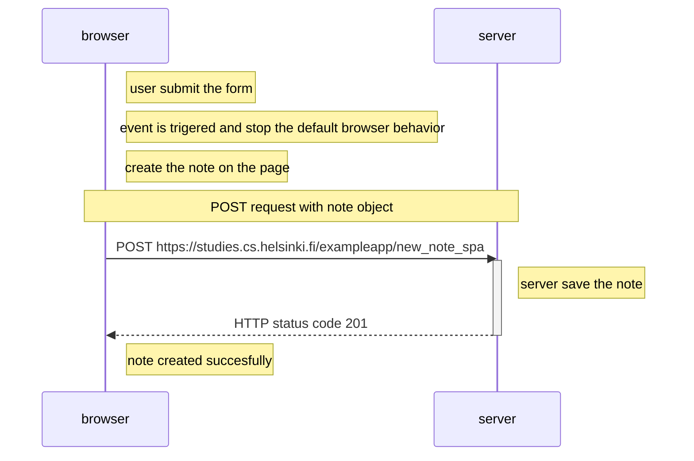

# Exercise 0.6 - New Note In Single Page App Diagram

```mermaid
sequenceDiagram
    
    participant browser
    participant server

    %% 1) user submit the form
    note right of browser : user submit the form

    %% 2) sumbit event is trigered and stop the default browser behavior 
    note right of browser : event is trigered and stop the default browser behavior

    %% 3) create the note on the page 
    note right of browser : create the note on the page 

    %% 4) send POST request to the server with the note object
    note over browser,server : POST request with note object
    browser->>server : POST  https://studies.cs.helsinki.fi/exampleapp/new_note_spa

    %% 5) server save the note 
    activate server
    note right of server : server save the note

    %% 6) server responds with HTTP status code 201
    server-->>browser : HTTP status code 201
    deactivate server
    note right of browser : note created succesfully

```
